<!-- require APlayer -->
<link rel="stylesheet" href="/renderjs/aplayer/dist/APlayer.min.css">
<script src="/renderjs/aplayer/dist/APlayer.min.js"></script>
<!-- require MetingJS -->
<script src="/renderjs/meting/dist/Meting.min.js"></script>


<meting-js
    name="I Really Want to Stay at Your House"
    artist="Rosa Walton_Hallie Coggins"
    url="/voice/kugou/sophieSong/I Really Want to Stay at Your House - Rosa Walton_Hallie Coggins/I Really Want to Stay at Your House.mp3 "
    cover="/voice/kugou/sophieSong/I Really Want to Stay at Your House - Rosa Walton_Hallie Coggins/cyberpunk_lucy_moon.jpg"
    lrc="/voice/kugou/sophieSong/I Really Want to Stay at Your House - Rosa Walton_Hallie Coggins/I Really Want to Stay at Your House_合并歌词.lrc" 
    autoplay="false"
    loop="false"
    mutex="true">
</meting-js>


## **添加** mermaid 

### 添加 mermaid.html 

1. 在 Hugo 博客根目录下的 `layouts` 目录下新建 `partials\mermaid.html` (<u>注：如果没有该目录则按步骤新建该目录</u>)，如下：  
```bash
layouts  
|_____partials  
|     |______mermaid.html   

```
2. 在 `mermaid.html` 添加以下内容：  
```html
<!-- mermaid.html -->
{{ if .Params.mermaid }}  <!-- 判断是否开启 -->
<script type="module">  
    import mermaid from 'https://cdn.jsdelivr.net/npm/mermaid/dist/mermaid.esm.min.mjs'; 
    mermaid.initialize({ 
        startOnLoad: true,
        theme: 'default',
        // 添加以下配置项调整图表大小
        flowchart: {
            useMaxWidth: false,  // 禁用最大宽度限制
            htmlLabels: true,
            curve: 'basis'
        }
    });  
</script>  
<script>  
    // Replace mermaid pre.code to div  
    Array.from(document.getElementsByClassName("language-mermaid")).forEach(  
        (el) => {  
            el.parentElement.outerHTML = `<div class="mermaid">${el.innerHTML}</div>`;  
        }  
    );  
</script>  
<style>  
    /* 设置mermaid图表样式 */
    .mermaid {
        overflow: auto;  /* 添加滚动条以防图表过大 */
        text-align: center;
        margin: 1rem 0;
    }
    
    /* 设置svg大小适应容器 */
    .mermaid svg {  
        display: block;  
        margin: auto;
        max-width: 100%;  /* 确保不超过容器宽度 */
        height: auto;     /* 保持宽高比 */
    }  
    
    /* 可选：针对特定类型图表调整 */
    .mermaid .flowchart-link {
        stroke-width: 2px;
    }
</style>  
{{ end }}
```

~~(`PS:` 刚刚使用代码块时发现没有行号，参考别人的教程显示了行号，但复制代码块时连行号也一起复制了，所以还是选择没有行号吧 ):~~ 用 AI 修改已能正常复制代码💡2025-08-26 09:31。

- 上面代码在别人原有的代码上经过 `AI` 加工。其中 第 4 行：
```html
import mermaid from 'https://cdn.jsdelivr.net/npm/mermaid/dist/mermaid.esm.min.mjs'

```

- 可以引用本地 `mermaid` js, 引用如下:
```html
import mermaid from 'renderjs/mermaid/mermaid.esm.min.mjs'

```

### 本地引用 mermaid

1. 在引用本地 `mermaid` js 前，先在博客根目录 `static\` 创建 `renderjs` (或其它名称的文件) 用来存放 `mermaid` js 包。
```bash
|static
|_______renderjs
|       
```

2. 进入到 `renderjs` 目录，`npm` 下载 `mermaid`：
```bash
npm i mermaid

```

3. 下载好之后我发现当前目录多了一个文件夹 `node_module`, 进入文件夹找到 `mermaid` 后复制到 `static\` 目录下，复制后的目录如下：
```bash
|static
|_______renderjs
|       |_______mermaid
|               |_______dist
|               |_______mermaid.esm.min.mjs

```

### 复制 `single.html` 并修改

1. 从主题 (目前用的 blowfish) 下的 `layouts\_default\single.html` 复制到 博客目录 `layouts\_default\` 下：
```bash 
|layouts
|   |___ _default
|        |_____single.html 
|
|themes 
|   |_____blowfish 
|         |_____layouts
|               |_____ _default 
|                      |______single.html    
|

```

2. 修改复制后的 `single.html`, 找到`{{ .Content }}` 并在下面添加一行如下：
```html{{ .Content }}
{{ .Content }}
{{- partial "mermaid.html" . -}}
```

### 新建文章引用 `mermaid` 

1. 新建文档 mermaid.md 并添加头文件如下：
```markdown
---
title: "mermaid"
date: 2025-08-24
mermaid: true
---
```

2. 完整示例

````markdown
---
title: "mermaid"
date: 2025-08-24
mermaid: true
---

## 这是 mermaid示例

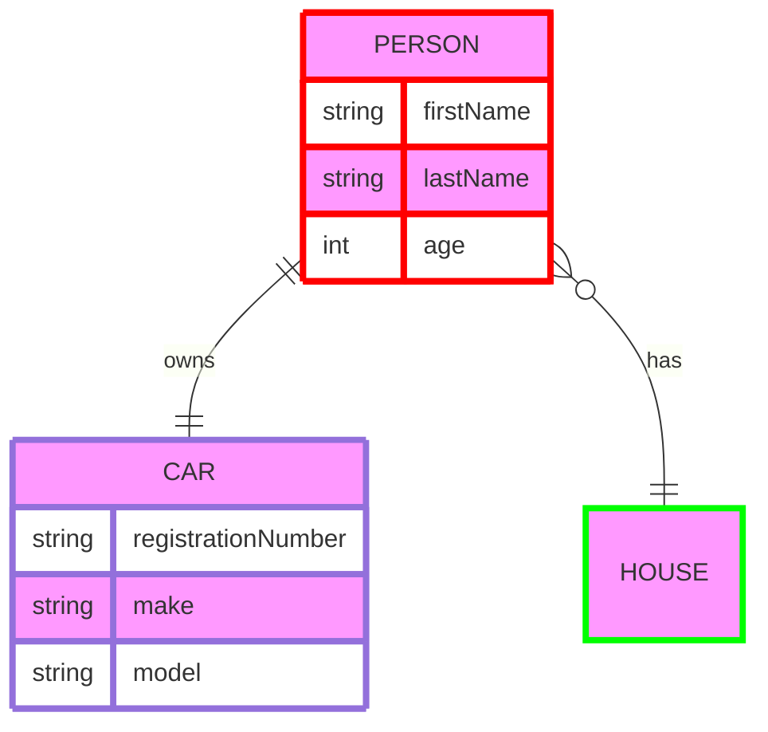

````


3. 示例渲染如下:


可以看到博客文章已经渲染出来 mermaid 图形了，大功告成！！！


## 其它示例

### erDiagram

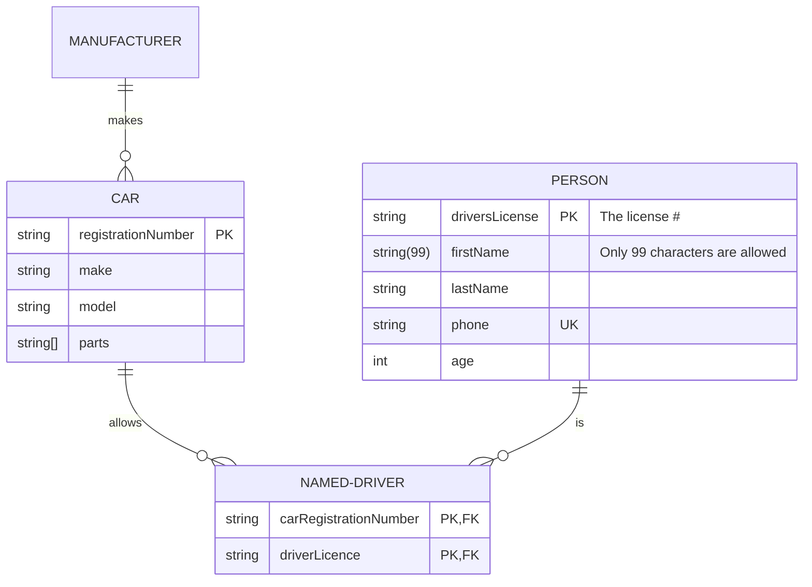


### quadrantChart


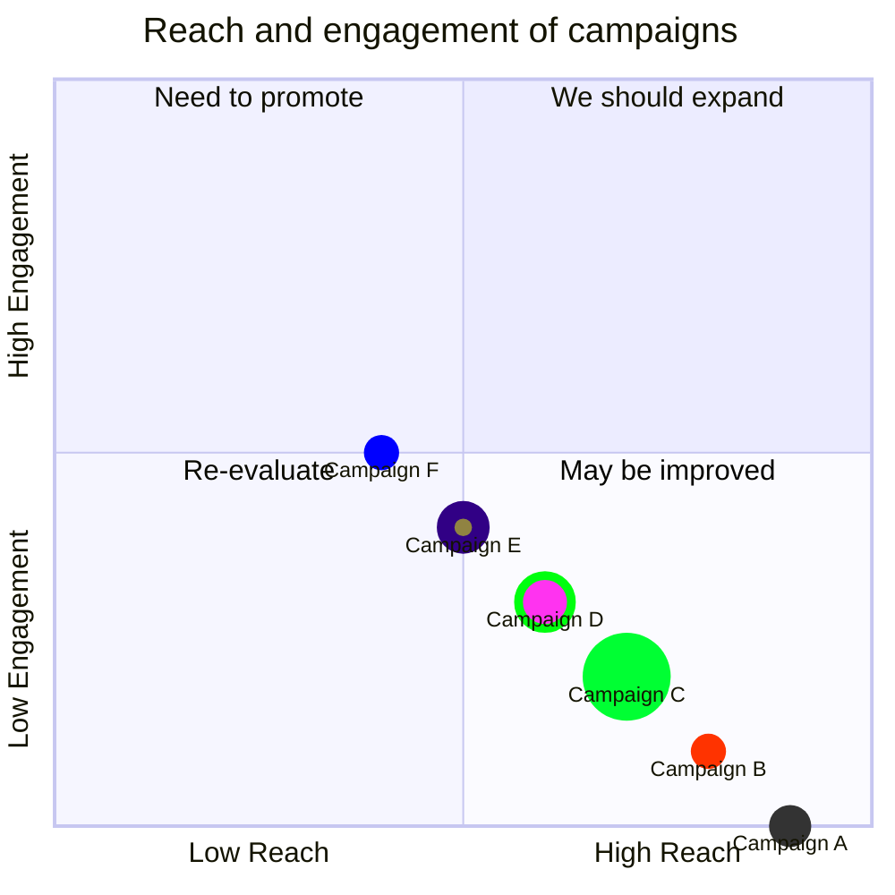
### stateDiagram-v2

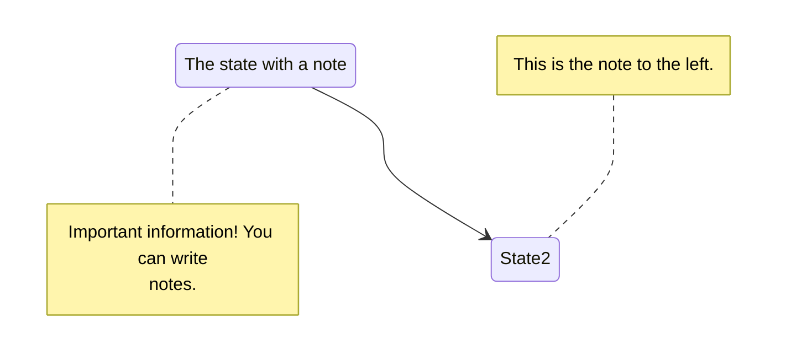

### xychart-beta

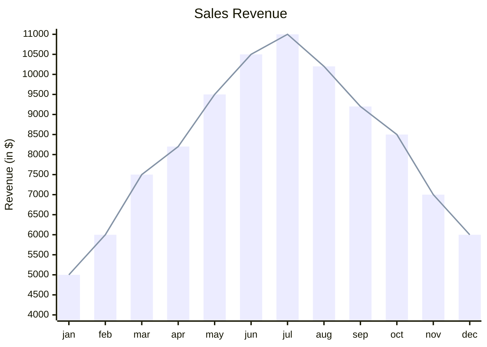

### flowchart

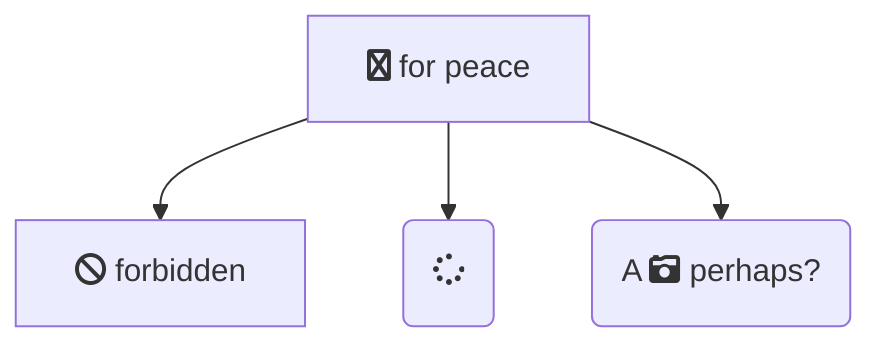

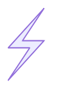

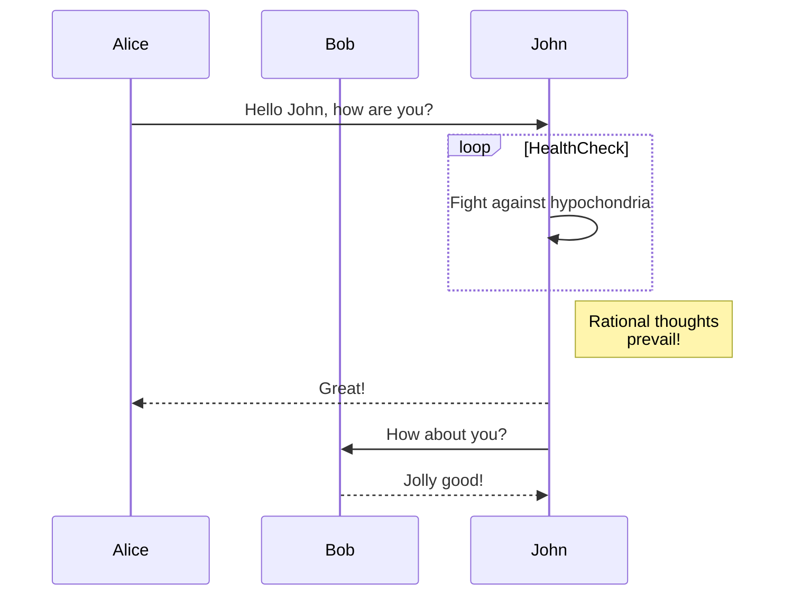

### git Graph

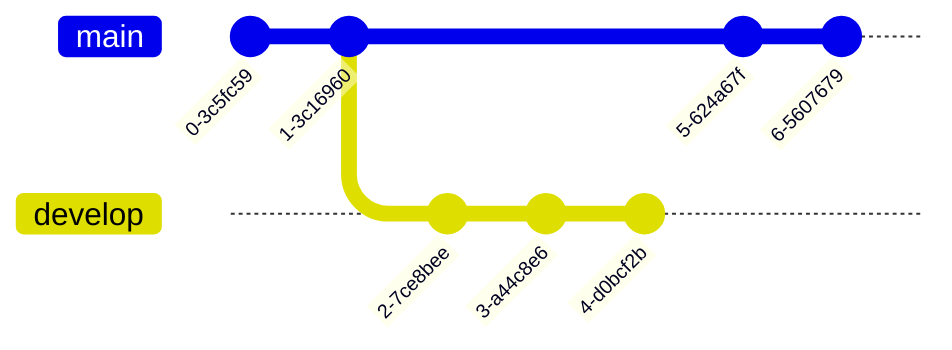

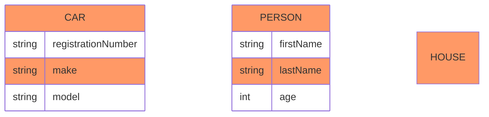

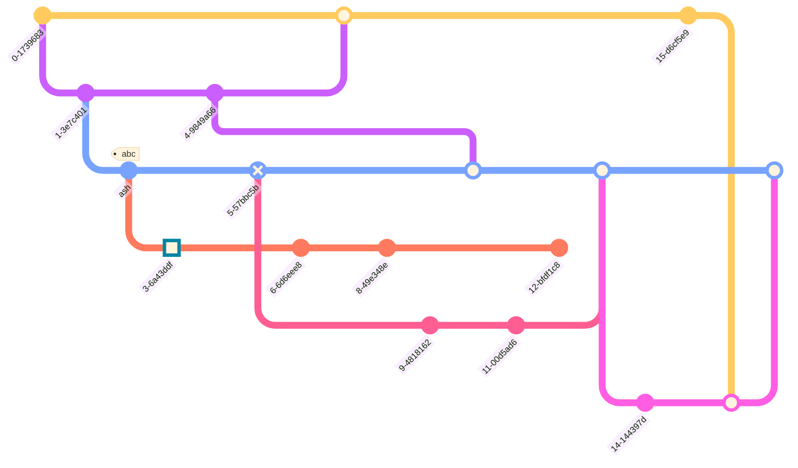

### C4Context

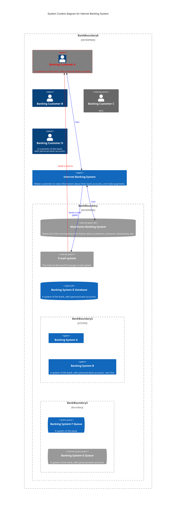

### mindmap

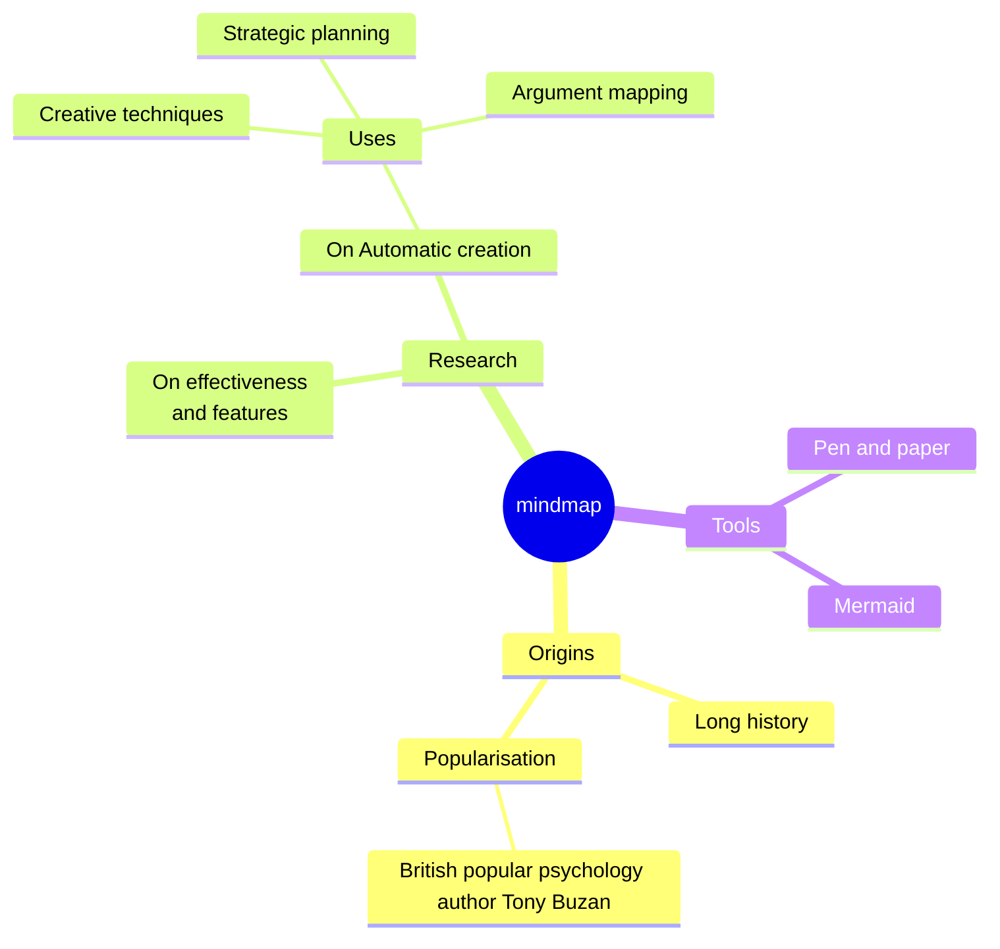

### timeline

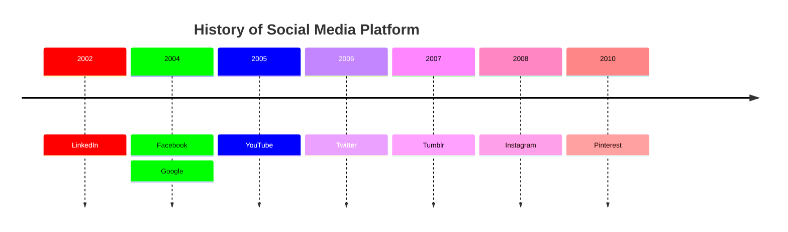


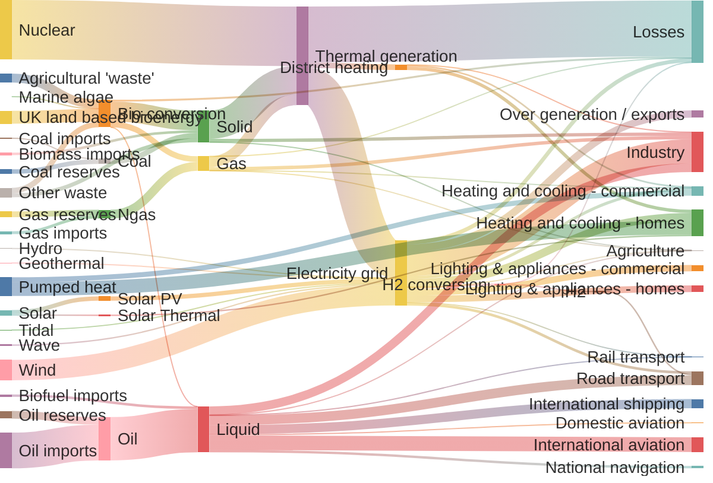

### kanban

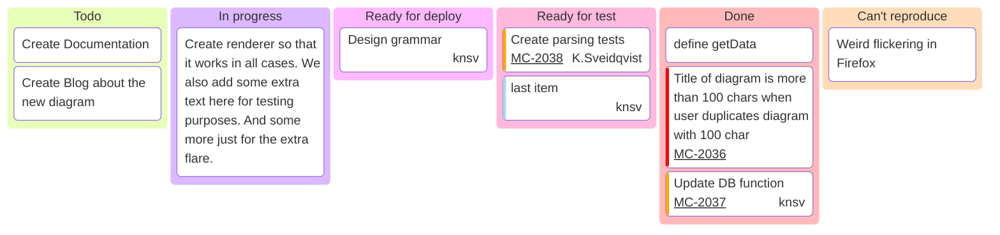

### radar 

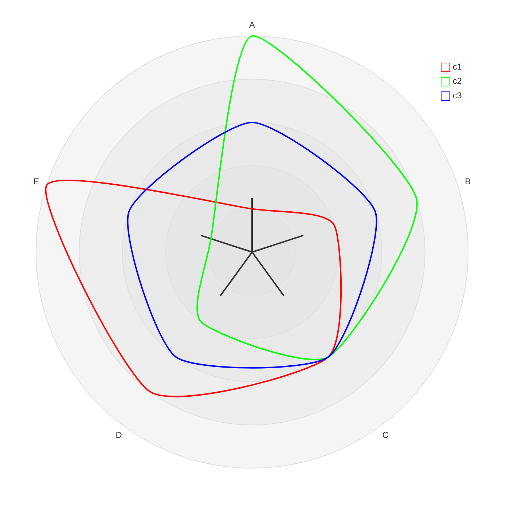


### treemap

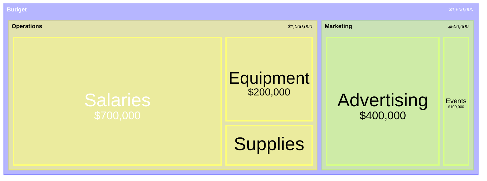


### latex

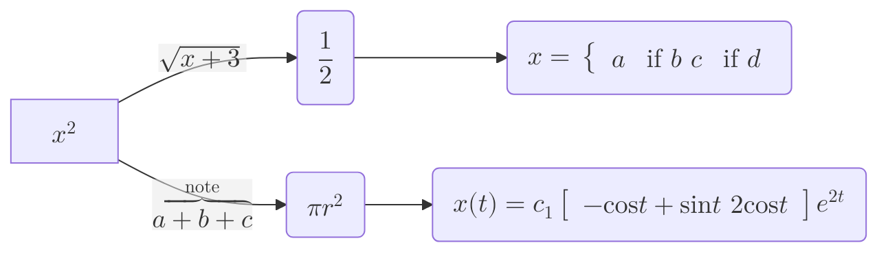

---
参考[1]：   
作者：[梧桐碎梦](https://wutongsuimeng.github.io/)   
参考链接：[https://wutongsuimeng.github.io/post/%E7%BB%99hugo%E6%B7%BB%E5%8A%A0mermaid%E6%94%AF%E6%8C%81/](https://wutongsuimeng.github.io/post/%E7%BB%99hugo%E6%B7%BB%E5%8A%A0mermaid%E6%94%AF%E6%8C%81/)  


